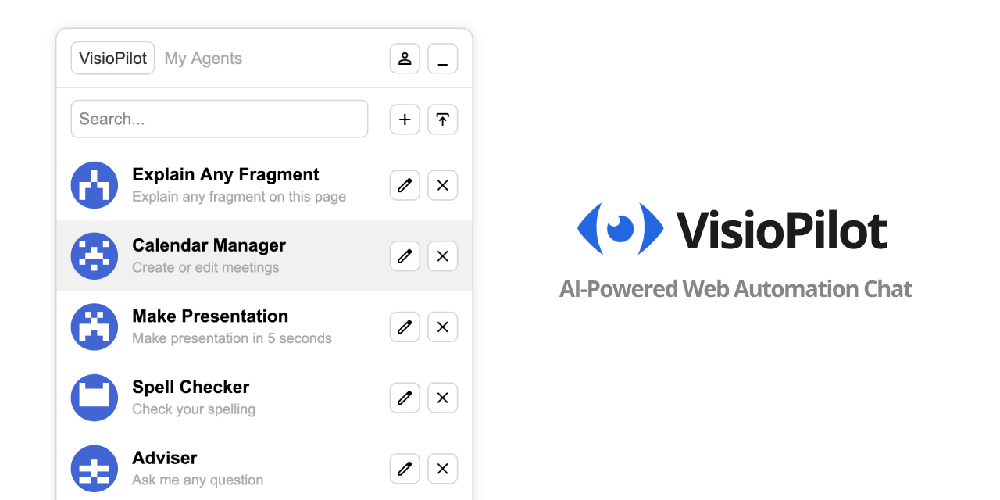

# VisioPilot

AI web automation chat that accelerates and automates daily tasks. Build custom AI agents with a no-code editor to get the job done. This extension adds an AI chat widget to every page, allowing you to easily automate hundreds of tasks. Automate social post creation, text summarization, copywriting tasks, presentation making, and much more. Import ready-to-use templates or create custom logic with the no-code editor. This extension requires paid credits for AI tasks, but we offer fair pricing.

Please note that we don't store any of your private data; everything is processed in your browser. Only AI tasks require sending prompts and responses to our servers. We don't store any of this data.

* [🦊 Install Extension for Firefox](https://addons.mozilla.org/en-US/firefox/addon/visiopilot/)
* [⭕ Install Extension for Chrome](https://chromewebstore.google.com/detail/visiopilot/kpkalljnibhiahfgkbgkgjibpeinfmpa)

This repository is only for bug reports and feature requests.

Links:

* [👀 Online Demos](https://visiopilot.com/online-demos)
* [🌐 Website](https://visiopilot.com)
* [📜 Privacy Policy](https://visiopilot.com/privacy-policy)
